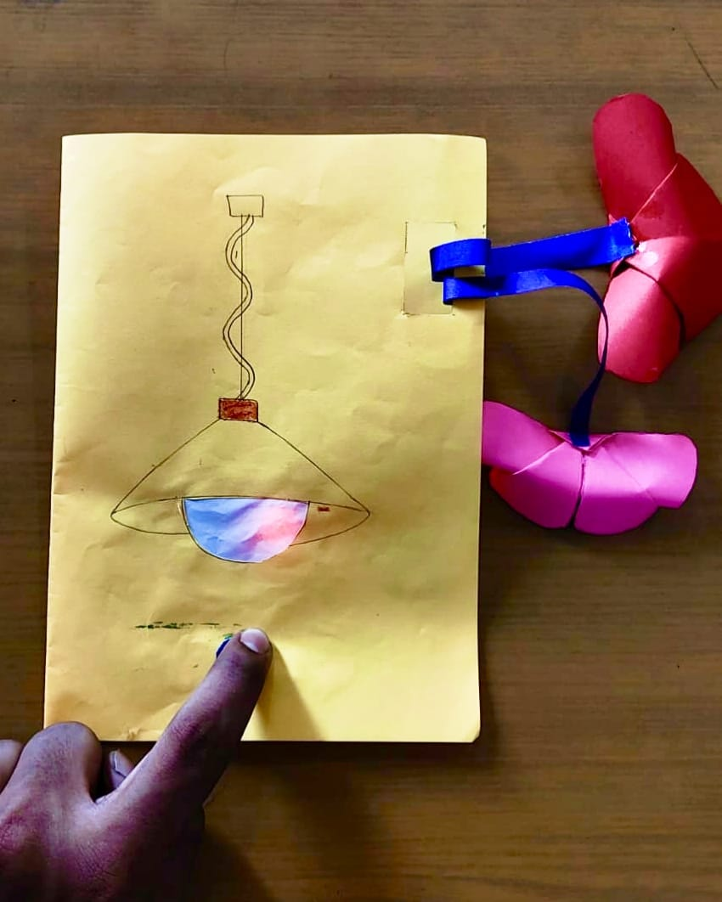
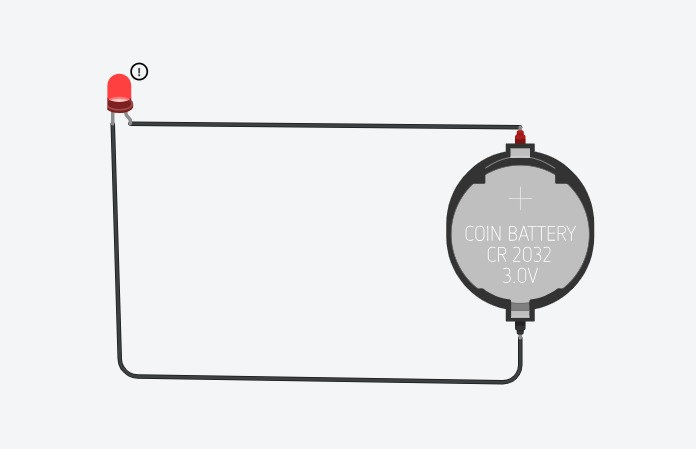

#  ILLUMINATED FOLDABLE GREETING CARD WITH TABLE-LAMP DESIGN

# 1\. INRODUCTION

This project is a foldable greeting card designed in the form of a miniature table lamp. It combines paper craft with a simple LED-based electrical circuit.

The LED is placed inside the paper lampshade to create an illumination effect. The design is lightweight, simple, and suitable for decorative and greeting purposes.  

## 2\. OBJECTIVES

To design a creative and functional greeting card.

To incorporate LED illumination into a paper structure.

To understand the basic operation of an LED circuit.

To learn the proper placement and connection of basic electronic components.

To combine creativity, paper design, and basic electronics.

# 3 .COMPONENTS REQUIRED

A4 / Card Paper-Forms the main body of the greeting card  
Coloured Paper-Used to create the lamp structure and decoration  
LED	Produces light  
Battery	Provides electrical power  
Connecting Wires	Connect the LED to the battery  
Ribbon	Supports folding and closing of the card  
Glue / Tape	Secures the paper and electronic component

# 4 CIRCUIT DISCRIPTION

The circuit is a simple battery-powered LED circuit consisting of a battery, LED, and connecting wires.

Circuit Connection

Battery (+) → LED → Battery (−)

The LED is connected according to its polarity. When the circuit is completed, current flows through the LED and it produces light.  

# 5 .COMPOUND FUNCTIONS

Battery

Provides the electrical energy required to operate the LED.

LED

       The LED is the light-producing component. It converts electrical energy into visible light.

Conducting aluminium sheet/paper   
            
        Holds the LED and provides the appearance and structure of a table lamp.

     
   
Glue / Tape

                Used to hold the paper structure, wires, and other components firmly in position                                  Provide the conducting path between the battery and LED\]

# 6 .COMPOUND PLACEMENT

The LED is positioned inside the paper lampshade so that its light illuminates the shade.

The battery is placed within or behind the card structure to maintain a neat appearance.

The connecting wires are routed along the paper structure and secured to prevent movement.

The ribbon is attached to the side of the card to support the folding and closing mechanism.

The placement is designed to maintain both proper circuit operation and a clean appearance.

# 7 .CONSTRUCTION

1\. An A4 sheet was selected and folded to form the main greeting-card body.

2\. The required paper shapes were prepared for the table-lamp structure.

3\. The coloured paper was folded and assembled to form the lampshade.

4\. A suitable position was provided for mounting the LED.

5\. The LED was placed inside the lampshade.

6\. The LED was connected to the battery using connecting wires.

7\. The wires were secured along the paper structure using tape.

8\. The ribbon was attached to provide the folding and closing mechanism.

9\. The complete structure was checked for proper alignment and stability.

10\. The circuit was tested to verify that the LED illuminated correctly.

# 8 .WORKING PRINCIPLE

The project works using the principle of a closed electrical circuit.

When the circuit is closed, the battery supplies electrical power through the connecting wires to the LED. The LED converts the electrical energy into light, illuminating the inside of the paper lampshade.

When the circuit is disconnected, current stops flowing and the LED turns off.

Working Flow

Battery → Connecting Wires → LED → Light

# 9 .RESULT

The Illuminated Foldable Greeting Card with Table-Lamp Design was successfully constructed and tested.

The LED operates when the circuit is completed and produces an illumination effect inside the paper lampshade. The card can also be folded and secured using the ribbon.

# 10 .ADVANTAGE

* Simple and easy to construct.  
    
* Low-cost materials are used.  
    
* Easy to operate.  
    
* Combines paper craft and basic electronics.  
    
* Can be customized with different colours and designs.  
    
* Suitable for various occasions and decorative purposes.

# 11 .CONCLUSION 

The project successfully demonstrates the integration of basic electronics with creative paper design. The LED circuit provides illumination, while the foldable paper structure gives the model its table-lamp appearance.  
The project provides practical understanding of LED operation, battery power, electrical connections, component placement, and simple prototype construction. It results in a simple, functional, and attractive illuminated greeting card.  

